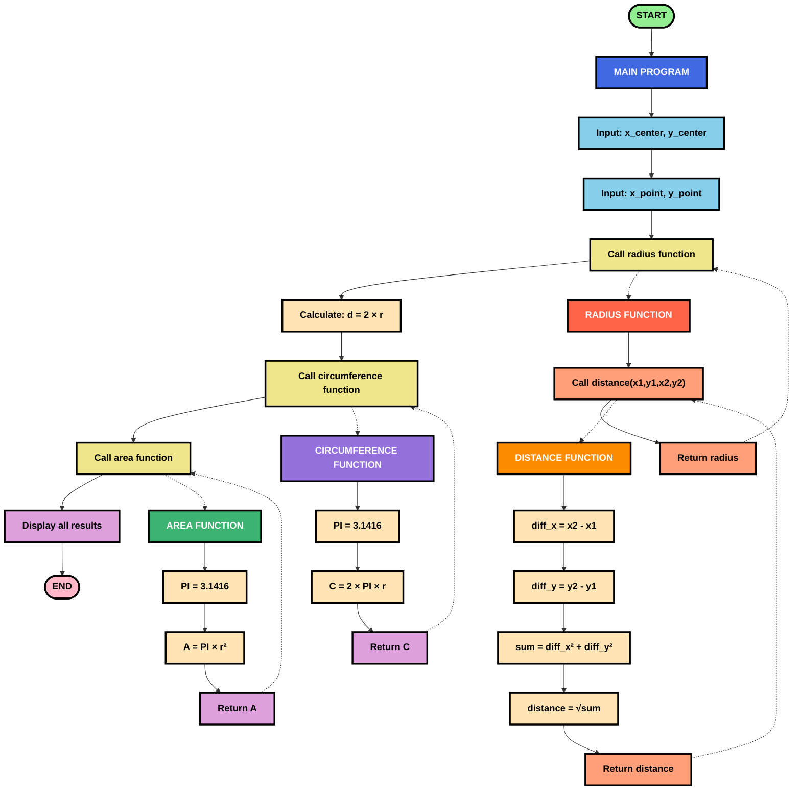

```mermaid
flowchart TB
    Start(["<b>START</b>"]) --> Main["<b>MAIN PROGRAM</b>"]
    
    Main --> Input1["<b>Input: x_center, y_center</b>"]
    Input1 --> Input2["<b>Input: x_point, y_point</b>"]
    Input2 --> CallR["<b>Call radius function</b>"]
    CallR --> CalcD["<b>Calculate: d = 2 × r</b>"]
    CalcD --> CallC["<b>Call circumference function</b>"]
    CallC --> CallA["<b>Call area function</b>"]
    CallA --> Output["<b>Display all results</b>"]
    Output --> End(["<b>END</b>"])
    
    CallR -.-> RadiusBox["<b>RADIUS FUNCTION</b>"]
    RadiusBox --> RadiusCall["<b>Call distance(x1,y1,x2,y2)</b>"]
    RadiusCall --> RadiusReturn["<b>Return radius</b>"]
    RadiusReturn -.-> CallR
    
    RadiusCall -.-> DistBox["<b>DISTANCE FUNCTION</b>"]
    DistBox --> Dist1["<b>diff_x = x2 - x1</b>"]
    Dist1 --> Dist2["<b>diff_y = y2 - y1</b>"]
    Dist2 --> Dist3["<b>sum = diff_x² + diff_y²</b>"]
    Dist3 --> Dist4["<b>distance = √sum</b>"]
    Dist4 --> DistReturn["<b>Return distance</b>"]
    DistReturn -.-> RadiusCall
    
    CallC -.-> CircumBox["<b>CIRCUMFERENCE FUNCTION</b>"]
    CircumBox --> Circum1["<b>PI = 3.1416</b>"]
    Circum1 --> Circum2["<b>C = 2 × PI × r</b>"]
    Circum2 --> CircumReturn["<b>Return C</b>"]
    CircumReturn -.-> CallC
    
    CallA -.-> AreaBox["<b>AREA FUNCTION</b>"]
    AreaBox --> Area1["<b>PI = 3.1416</b>"]
    Area1 --> Area2["<b>A = PI × r²</b>"]
    Area2 --> AreaReturn["<b>Return A</b>"]
    AreaReturn -.-> CallA
    
    style Start fill:#90EE90,stroke:#000,stroke-width:3px,color:#000
    style End fill:#FFB6C6,stroke:#000,stroke-width:3px,color:#000
    style Main fill:#4169E1,color:#fff,stroke:#000,stroke-width:3px
    style Input1 fill:#87CEEB,stroke:#000,stroke-width:3px,color:#000
    style Input2 fill:#87CEEB,stroke:#000,stroke-width:3px,color:#000
    style Output fill:#DDA0DD,stroke:#000,stroke-width:3px,color:#000
    style RadiusBox fill:#FF6347,color:#fff,stroke:#000,stroke-width:3px
    style DistBox fill:#FF8C00,color:#fff,stroke:#000,stroke-width:3px
    style CircumBox fill:#9370DB,color:#fff,stroke:#000,stroke-width:3px
    style AreaBox fill:#3CB371,color:#fff,stroke:#000,stroke-width:3px
    style CalcD fill:#FFE4B5,stroke:#000,stroke-width:3px,color:#000
    style CallR fill:#F0E68C,stroke:#000,stroke-width:3px,color:#000
    style CallC fill:#F0E68C,stroke:#000,stroke-width:3px,color:#000
    style CallA fill:#F0E68C,stroke:#000,stroke-width:3px,color:#000
    style RadiusCall fill:#FFA07A,stroke:#000,stroke-width:3px,color:#000
    style RadiusReturn fill:#FFA07A,stroke:#000,stroke-width:3px,color:#000
    style Dist1 fill:#FFE4B5,stroke:#000,stroke-width:3px,color:#000
    style Dist2 fill:#FFE4B5,stroke:#000,stroke-width:3px,color:#000
    style Dist3 fill:#FFE4B5,stroke:#000,stroke-width:3px,color:#000
    style Dist4 fill:#FFE4B5,stroke:#000,stroke-width:3px,color:#000
    style DistReturn fill:#FFA07A,stroke:#000,stroke-width:3px,color:#000
    style Circum1 fill:#FFE4B5,stroke:#000,stroke-width:3px,color:#000
    style Circum2 fill:#FFE4B5,stroke:#000,stroke-width:3px,color:#000
    style CircumReturn fill:#DDA0DD,stroke:#000,stroke-width:3px,color:#000
    style Area1 fill:#FFE4B5,stroke:#000,stroke-width:3px,color:#000
    style Area2 fill:#FFE4B5,stroke:#000,stroke-width:3px,color:#000
    style AreaReturn fill:#DDA0DD,stroke:#000,stroke-width:3px,color:#000
```